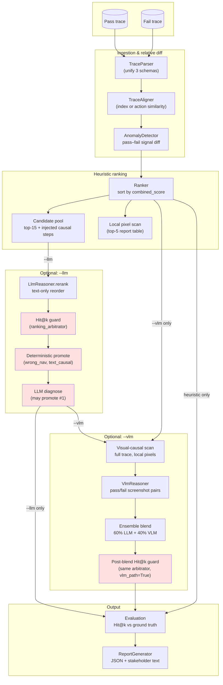
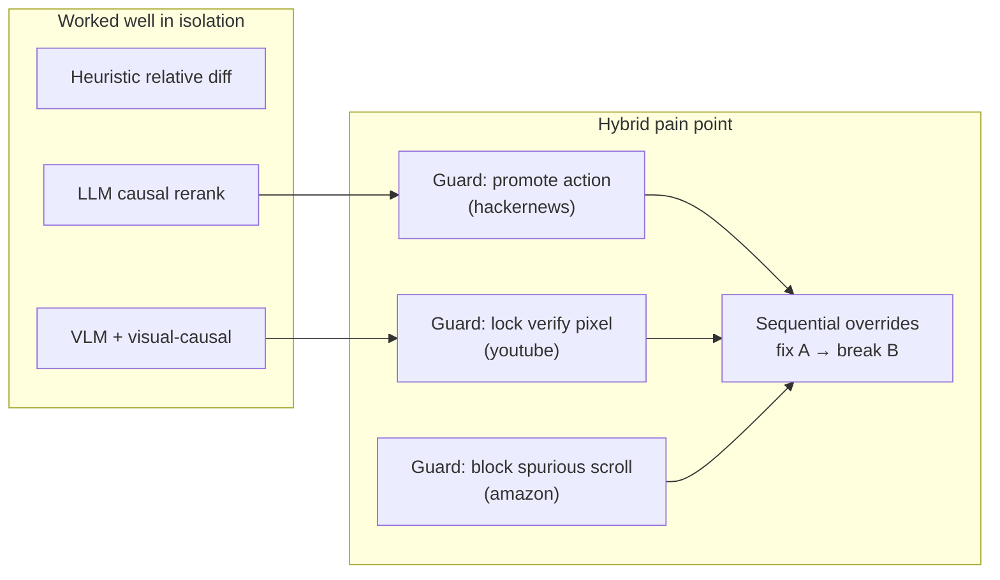
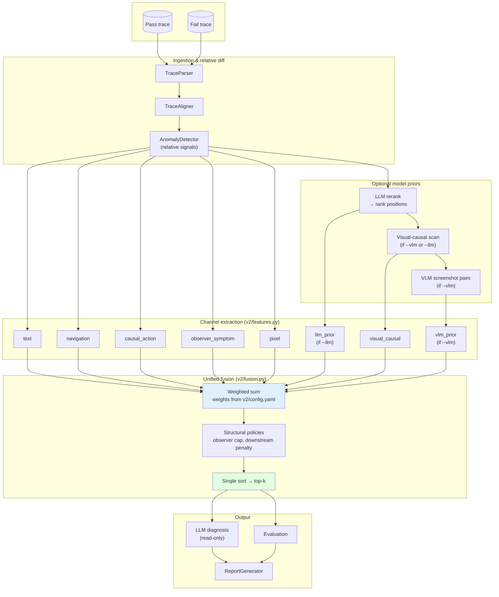
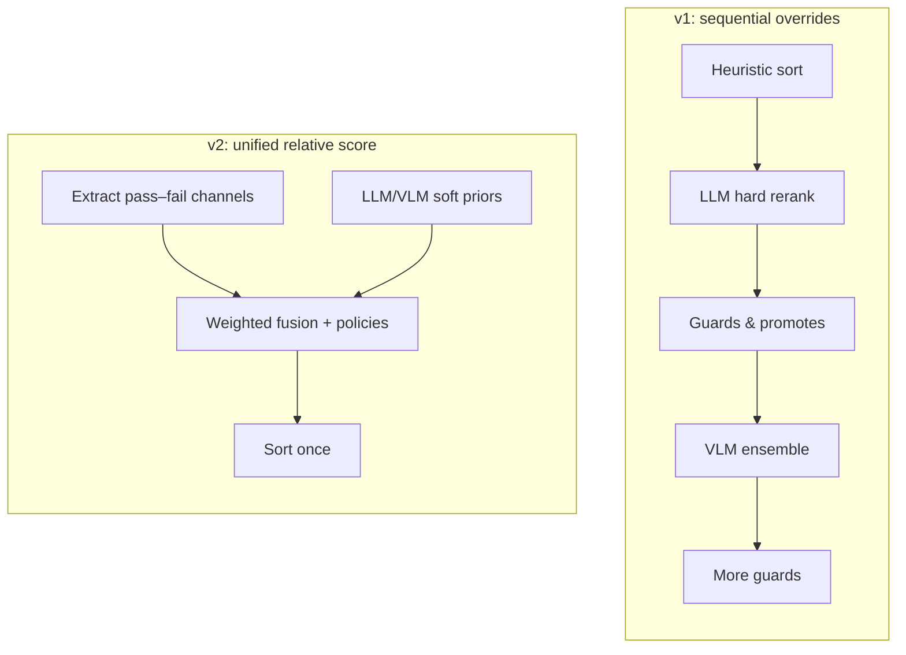
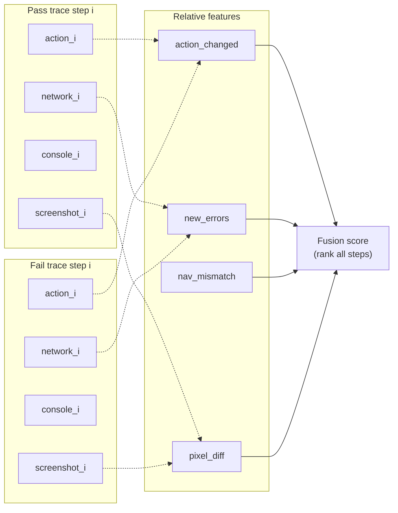

# TraceLens Architecture Diagrams (v1 & v2)

Publication-ready pipeline figures for the ICSE paper. Render with any Mermaid viewer, GitHub, or export via [mermaid.live](https://mermaid.live).

**Task framing:** *Relative debugging* — given a **pass** and **fail** trace of the same UI test, localize the earliest step whose divergence explains the regression.

---

## Diagram A — v1 pipeline (`main.py`)

Stacked stages with **multiple ranking overrides**. Hybrid mode runs LLM first, then VLM, then a **second** arbitration pass — the source of trace-specific brittleness.

### v1 mode summary

| Mode | Final rank decided by |
|------|------------------------|
| Heuristic | `Ranker` (+ pixel mutates rank if enabled) |
| `--llm` | LLM rerank → guards → deterministic → diagnosis |
| `--vlm` | Visual-causal re-rank → VLM → guards |
| `--llm --vlm` | LLM path **then** VLM ensemble **then** second guard pass |

**Red nodes** = stages that can **override** the previous ordering (fragmentation).

### Why v1 hybrid underperformed expectations

Each guard encoded a **benchmark trace pattern**. Hybrid activated **both** LLM and VLM override paths, so conflicts surfaced more often than in single-modality modes.

---

## Diagram B — v2 pipeline (`main2.py`) — paper main figure

**Single fusion sort.** LLM and VLM contribute **soft priors**; diagnosis never changes rank.

### v2 mode summary

| Mode | Channels active | Ranking |
|------|-----------------|---------|
| Heuristic | text, nav, causal, observer, pixel | Fusion (no model priors) |
| `--llm` | + llm_prior | Same fusion function |
| `--vlm` | + visual_causal, vlm_prior | Same fusion function |
| `--llm --vlm` | All channels | Same fusion function |

**Green node** = exactly **one** final sort (no post-hoc promotes).

---

## Diagram C — Side-by-side (for paper appendix or slide)

---

## Relative debugging data flow (conceptual)

---

## Exporting for LaTeX

1. Paste diagram into [mermaid.live](https://mermaid.live) → Export PNG/SVG.
2. Suggested filenames for paper:
   - `figures/arch_v1_pipeline.pdf`
   - `figures/arch_v2_pipeline.pdf` (Figure 1 main)
   - `figures/arch_v1_v2_compare.pdf`
3. Captions:
   - **Fig 1 (v2):** “TraceLens v2 relative debugging pipeline. Pass and fail traces are aligned and differenced into multimodal channels; optional LLM/VLM priors feed a single weighted fusion ranker.”
   - **Fig A (v1):** “v1 stacked pipeline with post-hoc Hit@1 guards (red). Hybrid mode applies LLM and VLM override stages sequentially.”

---

## Cross-references

- Paper plan: [`ICSE_PAPER_PLAN.md`](ICSE_PAPER_PLAN.md)
- v1 guard policy: [`RANKING_ARBITRATION.md`](RANKING_ARBITRATION.md)
- Mode details: [`MODES.md`](MODES.md)
- v2 README: [`../v2/README.md`](../v2/README.md)
